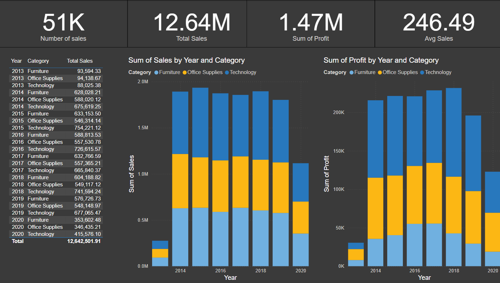

# superstore_PBI
This repo utilises Power BI to make a report on business progression over the course of 2013-2020. The data was supplied by Microsoft for the purpose of training, and is not considered valid data. It entails a spread of four pages that seek to answer the questions outlined on this readme

Question 1: What were the total sales for the company?
- The total sales for the company over the 2013-2020 period was US $12.64mil. This is inclusive of US$1.47mil profit and made up from around 51K sales

Question 2: Which market(s) generated the most sales on average?
- The top 5 countries for average sales were as follows:
1) Lesotho ($1118.67)
2) Montenegro ($1001.09)
3) Chad (658.52)
4) Taiwan (546.26)
5) South Sudan (522.81)

Question 3: What were the profits by segment? Which was the most profitable?
When comparing the three segments against profit per year, the trend shows at all times that 'consumer' shows the most profit per year, followed by 'corporate', with 'home office' being the lowest per year

Question 4: What products were the best selling products?
In the context of profit, electronics held the highest value with the four highest products ranging from $25.2K-$11.8K
If looking at the quantity of products sold, office supplies sold at a much higher rate than other categories- seen particularly through staples.

Question 5: Are there key areas that are not profitable?
There were a considerable number of products that did not sell well over the time perdiod. The products with the most losses were technological products, primarily machines. On average, the furniture category holds a significant portion of products that were not profitable in the 4-figures, ranging from $-1000 to $-3700